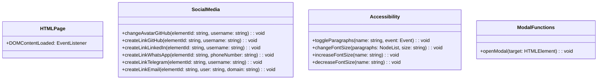

```mermaid
classDiagram
  class HTMLPage {
    +DOMContentLoaded: EventListener
  }

  class SocialMedia {
    +changeAvatarGitHub(elementId: string, username: string): void
    +createLinkGitHub(elementId: string, username: string): void
    +createLinkLinkedIn(elementId: string, username: string): void
    +createLinkWhatsApp(elementId: string, phoneNumber: string): void
    +createLinkTelegram(elementId: string, username: string): void
    +createLinkEmail(elementId: string, user: string, domain: string): void
  }

  class Accessibility {
    +toggleParagraphs(name: string, event: Event): void
    +changeFontSize(paragraphs: NodeList, size: string): void
    +increaseFontSize(name: string): void
    +decreaseFontSize(name: string): void
  }

  class ModalFunctions {
    +openModal(target: HTMLElement): void
  }

```  
