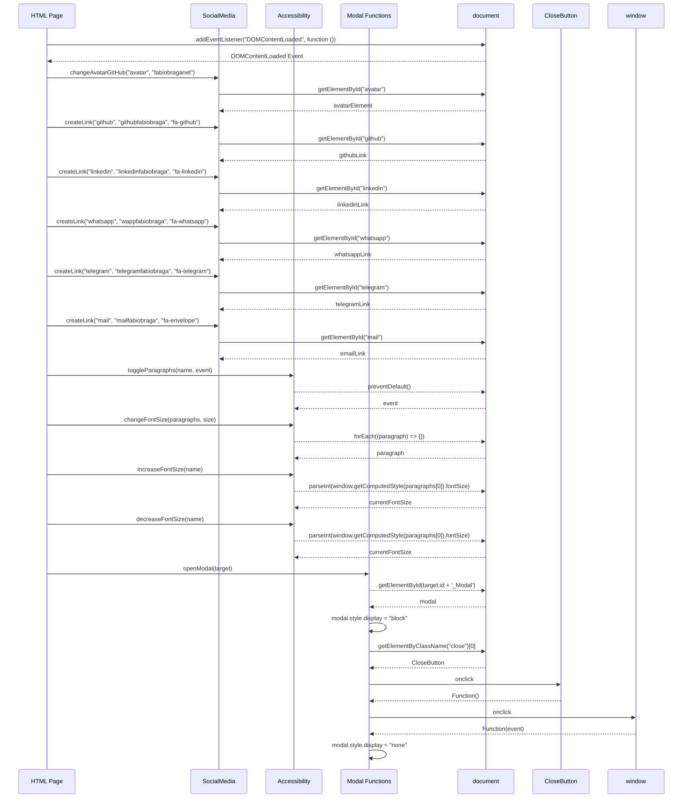

```mermaid
sequenceDiagram
  participant HTMLPage as HTML Page
  participant SocialMediaClass as SocialMedia
  participant AccessibilityClass as Accessibility
  participant ModalFunctions as Modal Functions

  HTMLPage ->> document: addEventListener("DOMContentLoaded", function ())
  document -->> HTMLPage: DOMContentLoaded Event

  HTMLPage ->> SocialMediaClass: changeAvatarGitHub("avatar", "fabiobraganet")
  SocialMediaClass ->> document: getElementById("avatar")
  document -->> SocialMediaClass: avatarElement

  HTMLPage ->> SocialMediaClass: createLink("github", "githubfabiobraga", "fa-github")
  SocialMediaClass ->> document: getElementById("github")
  document -->> SocialMediaClass: githubLink

  HTMLPage ->> SocialMediaClass: createLink("linkedin", "linkedinfabiobraga", "fa-linkedin")
  SocialMediaClass ->> document: getElementById("linkedin")
  document -->> SocialMediaClass: linkedinLink

  HTMLPage ->> SocialMediaClass: createLink("whatsapp", "wappfabiobraga", "fa-whatsapp")
  SocialMediaClass ->> document: getElementById("whatsapp")
  document -->> SocialMediaClass: whatsappLink

  HTMLPage ->> SocialMediaClass: createLink("telegram", "telegramfabiobraga", "fa-telegram")
  SocialMediaClass ->> document: getElementById("telegram")
  document -->> SocialMediaClass: telegramLink

  HTMLPage ->> SocialMediaClass: createLink("mail", "mailfabiobraga", "fa-envelope")
  SocialMediaClass ->> document: getElementById("mail")
  document -->> SocialMediaClass: emailLink

  HTMLPage ->> AccessibilityClass: toggleParagraphs(name, event)
  AccessibilityClass -->> document: preventDefault()
  document -->> AccessibilityClass: event

  HTMLPage ->> AccessibilityClass: changeFontSize(paragraphs, size)
  AccessibilityClass -->> document: forEach((paragraph) => {})
  document -->> AccessibilityClass: paragraph

  HTMLPage ->> AccessibilityClass: increaseFontSize(name)
  AccessibilityClass -->> document: parseInt(window.getComputedStyle(paragraphs[0]).fontSize)
  document -->> AccessibilityClass: currentFontSize

  HTMLPage ->> AccessibilityClass: decreaseFontSize(name)
  AccessibilityClass -->> document: parseInt(window.getComputedStyle(paragraphs[0]).fontSize)
  document -->> AccessibilityClass: currentFontSize

  HTMLPage ->> ModalFunctions: openModal(target)
  ModalFunctions -->> document: getElementById(target.id + '_Modal')
  document -->> ModalFunctions: modal

  ModalFunctions ->> ModalFunctions: modal.style.display = "block"
  ModalFunctions ->> document: getElementByClassName("close")[0]
  document -->> ModalFunctions: CloseButton

  ModalFunctions ->> CloseButton: onclick
  CloseButton -->> ModalFunctions: Function()

  ModalFunctions ->> window: onclick
  window -->> ModalFunctions: Function(event)

  ModalFunctions ->> ModalFunctions: modal.style.display = "none"

```  
